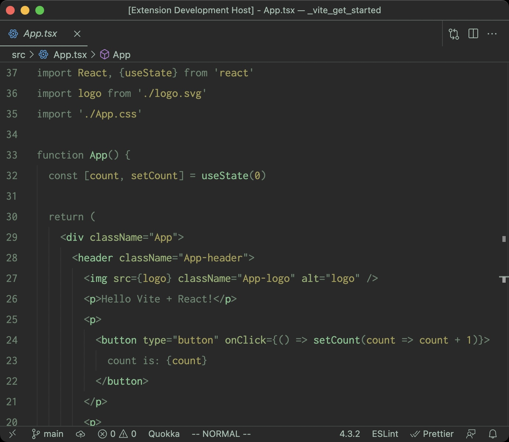
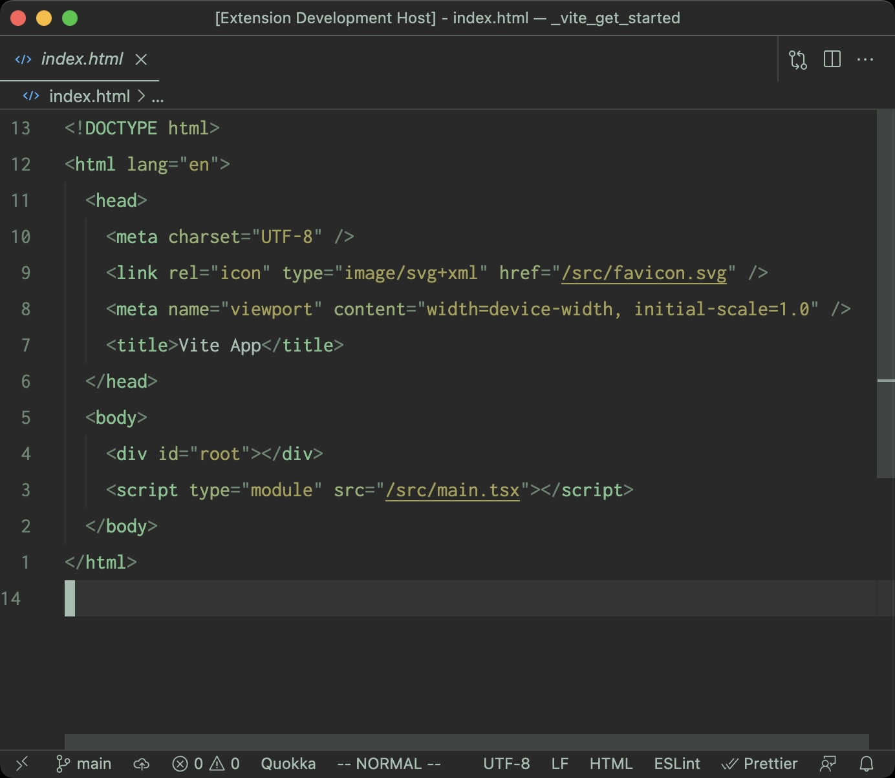
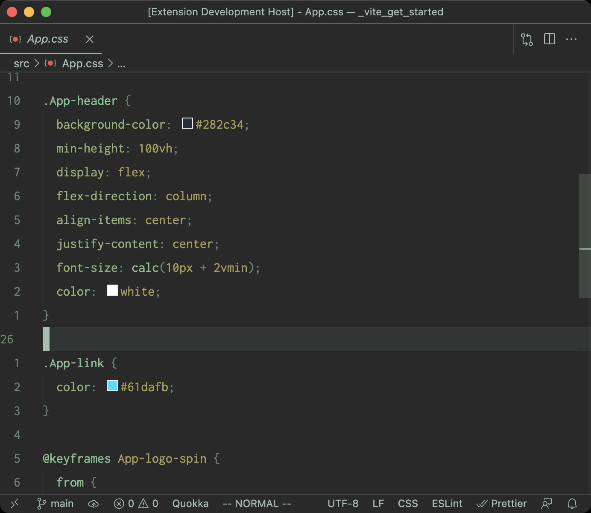

## Conifer Themes

VSCode themes for the weary eyes 👀

1. Conifer
2. Pine Cone
3. Pine Needle
4. Mist
5. Evergreen

## Palette

| Scope | Color | Hex |
| ----- | ----- | --- |
| Background |  | #292929 | 
| Foreground |  | #A7BEB1 | 
| Accent |  | #6D8571 | 
| Accent |  | #98B077 | 
| Accent |  | #A59F5D | 
| Accent |  | #8BC191 | 
| Accent |  | #C1918B | 

### Syntax

| Scope | Color | Hex |
| ----- | ----- | --- |
| Tag, Object, Function, Selector |  | #8BC191 | 
| Text |  | #A7BEB1 | 
| Comment, Operator, Punctuation, Keyword |  | #6D8571 | 
| Attribute, Property, Type |  | #98B077 | 
| Variable, Param, String, Primitive/Value, Link |  | #A59F5D | 

### Terminal-specific

| Scope | Color | Hex |
| ----- | ----- | --- |
| Magenta |  | #C18BBB | 

**Enjoy!**

[Open repo in Visual Studio Code](https://open.vscode.dev/imalbert/conifer-vscode-theme)
